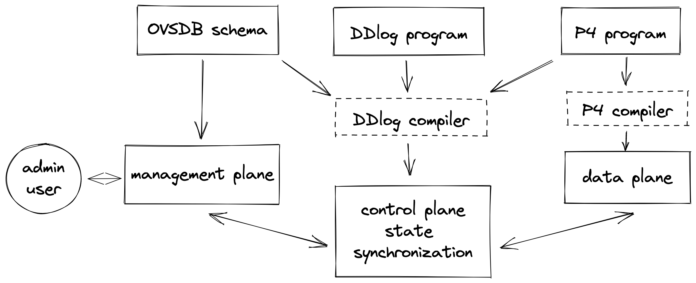
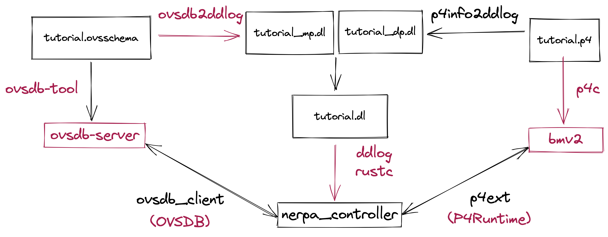

# A Nerpa Tutorial

## Introduction

Nerpa, short for "Network Programming with Relational and Procedural Abstractions", is a programming framework to simplify the management of a programmable network. It implements an incremental control plane and allows for tighter integration and co-design of the control plane and data plane.

In this tutorial we demonstrate how to write and run a Nerpa program.

## Nerpa at a high level



A Nerpa program consists of three sub-programs, each corresponding to a plane of an enterprise network.
* The management plane sets high-level policy for the network devices. We use Open vSwitch Database (OVSDB) for the management plane. An OVSDB schema initializes the management plane. The admin user can insert, modify, or delete rows in the database to represent changes in high-level configuration.
* The control plane configures the data plane based on the declared state of the network. We use a Differential Datalog (DDlog) program for the control plane. A DDlog program consists of rules that compute a set of output relations based on input relations. These rules are evaluated incrementally: given a set of changes to the input relations, DDlog produces a set of changes to the output relations. Those output relations are converted to match-action contents of P4 tables and then written to the switch.
* The data plane processes packets that pass through the system. We program this using a P4 program. A P4 program specifies how data plane devices, like switches and routers, process packets.

DDlog input and output relations are generated from the OVSDB schema and P4 program. They are imported by the DDlog program that is compiled and used as the control plane. This facilitates codesign and tighter integration of the control and data planes.

The Nerpa controller synchronizes state between the planes. It does the following:
* Listens for changes from the OVSDB management plane; converts them into DDlog input relations; and sends them to the control plane
* Receives DDlog output relations from the control plane; converts them into P4 entries; and sends them to the data plane
* Listens for digest notifications from the P4 data plane; converts them into DDlog input relations; and sends them to the control plane

## Setup

Installation instructions are found in the [README](../../README.md/#installation). To verify installation, confirm that the following environment variables are set:
* `$NERPA_DEPS`, to the directory containing the `behavioral-model` directory.
* `$DDLOG_HOME`, to the DDlog installation directory. Make sure `$PATH` includes the DDlog binary.

## Write a Nerpa Program

### Problem: VLAN Assignment
In this tutorial, we'll create a new Nerpa program called `tutorial`.  We will demonstrate how to write, build, and run a Nerpa program. This program will implement VLAN assignment, which assigns ports to VLANs. A port is represented using its ID; the type of VLAN; a tag; trunks; and priority. In a DDlog program, the input relations would represent ports, and the output relations represent the assigned VLANs.

Below, we instantiate the system diagram above for the `tutorial` example.



### Create a New Program
We start by creating a new program. Note that all commands should be run from the top-level `nerpa` directory. Run the [creation script](../../scripts/create-new-nerpa.sh):
```
./scripts/create-new-nerpa.sh tutorial
```

Alternately, you can execute the script instructions manually one-by-one.

This should create a Nerpa program in `nerpa_controlplane/tutorial`, composed of the following files:
* `tutorial.dl`: Datalog program implementing the control plane, that will run on a centralized controller
* `tutorial.p4`: P4 program implementing the data plane, that will run on a software switch
* `tutorial.ovsschema`: OVSDB schema specifying the management plane 
* `commands.txt`: commands sent to the P4 switch's command-line interface and used to initialize the control plane

Accordingly, before moving forward, make sure that the following directory structure exists:
```
nerpa_controlplane/tutorial
| +-- commands.txt
| +-- tutorial.dl
| +-- tutorial.ovsschema
| +-- tutorial.p4
```

These files should have the following contents.

* `commands.txt` should be empty.

* `tutorial.dl` should only contain the following comments.
```
// Uncomment the following imports after running p4info2ddlog and generating relations from the P4 program and OVSDB schema.
// import tutorial_dp as tutorial_dp
// import Tutorial_mp as tutorial_mp
```
* `tutorial.ovsschema` should contain this empty schema.
```
{
    "name": "tutorial",
    "tables": {},
    "version": "1.0.0"
}
```
* `tutorial.p4` should be an empty P4 program.

### Program the Management Plane
We will first program the management plane by designing the OVSDB schema. We start here, because this explains the application's goal and is the simplest part of the program. Writing it down carefully ensures that you understand the problem at hand.

To do this, copy the contents of [tutorial.ovsschema](tutorial.ovsschema) into `nerpa_controlplane/tutorial/tutorial.ovsschema`.

We pass the OVSDB schema as input to the `ovsdb2ddlog` tool, which generates DDlog relations from the schema. This helps us directly read changes from OVSDB and convert them to inputs for the running DDlog program.

To do this, run the following command. This, and all other commands in this tutorial, should be run from the top-level `nerpa` directory:
```
ovsdb2ddlog --schema-file=nerpa_controlplane/tutorial/tutorial.ovsschema --output-file=nerpa_controlplane/tutorial/Tutorial_mp.dl
```

Compare the output file with [Tutorial_mp.dl](Tutorial_mp.dl) to verify its contents.

### Program the Data Plane
To program the data plane, we write the P4 program. `tutorial.p4` specifies how packets with a VLAN header should be processed. P4 is a low-level language with many restrictions, and the DDlog program must cater to those restrictions.

Copy the contents of [tutorial.p4](tutorial.p4) into `nerpa_controlplane/tutorial/tutorial.p4`.

Compile the P4 program, and generate P4Runtime files:
```
cd nerpa_controlplane/tutorial
p4c --target bmv2 --arch v1model --p4runtime-files tutorial.p4info.bin,tutorial.p4info.txt tutorial.p4
cd ../..
```

Use the `p4info2ddlog` tool to generate relations and helper functions from the compiled P4 program. Generating relations ensures that DDlog output relations can be converted to P4 match-action tables, and that P4 digests can be converted to DDlog input relations. Helper functions facilitate this type conversion within the Nerpa codebase.
```
cd p4info2ddlog
cargo run ../nerpa_controlplane/tutorial tutorial ../dp2ddlog
cd ..
```

Compare the output file with [tutorial_dp.dl](tutorial_dp.dl) to verify its contents.

### Program the Control Plane
To program the control plane, we write the DDlog program that sits in between OVSDB and the P4 switch. Because we have generated the input and output relations, we know what the inputs and outputs to the control plane look like. The DDlog program connects these and implements the control plane's actions, by computing output changes from the input changes.

Copy the contents of [tutorial.dl](tutorial.dl) into `nerpa_controlplane/tutorial/tutorial.dl`.

Compile the DDlog program, and build the generated crate. This generates the Rust code for the `tutorial` DDlog program.
```
cd nerpa_controlplane/tutorial
ddlog -i tutorial.dl
cd tutorial_ddlog
cargo build
cd ../../..
```

### Build the Nerpa Program
Now that each sub-program exists, we can build the Nerpa tutorial program end-to-end:
```
./scripts/build-nerpa.sh nerpa_controlplane/tutorial tutorial
```

The build script executes the following steps. You will notice that Steps 1 to 5 replicate commands you have already run in the tutorial. 

1. Check if the Nerpa dependencies were installed correctly, specifically the DDlog environment variables `$DDLOG_HOME` and in `$PATH`, and the Nerpa dependencies directory `$NERPA_DIR`.
2. Generate the DDlog relations from the OVSDB schema using `ovsdb2ddlog`. This is more fully described in the [management plane](#program-the-management-plane) section.
3. Compile the P4 program using `p4c`. This is more fully described in the [data plane](#program-the-data-plane) section. Compilation also creates a P4info file.
4. Generate DDlog relations from the P4info file using `p4info2ddlog`. This is also described in the [data plane](#program-the-data-plane) section.
5. Compile the DDlog program and build the generated DDlog crate. This is described in the [control plane](#program-the-control-plane) section.
6. Build `ovsdb_client`, the OVSDB client library crate. Because this client crate depends on the DDlog crate, we must first generate the `Cargo.toml` to ensure that it correctly imports the DDlog dependencies. This library crate can read output changes from a running OVSDB, and convert those changes to input relations.`nerpa_controller` uses this library to listen to changes from OVSDB and process those input relations in the control plane DDlog program.
7. Build `nerpa_controller`, the controller crate. As mentioned at the [beginning](#nerpa-at-a-high-level), this crate synchronizes state between the planes. It listens for new inputs from the management and data planes; passes inputs to the control plane program; and writes any computed output changes to the data plane.

### Run the Nerpa Program

Run the Nerpa program, starting all pieces of software.
```
./scripts/run-nerpa.sh nerpa_controlplane/tutorial tutorial
```

The run script executes the following steps.
1. Check that the Nerpa dependencies were installed as expected. Specifically, it confirms that the environment variable `$NERPA_DEPS` points to a directory that contains the `behavioral-model` subdirectory.
2. Run `simple_switch_grpc`, the virtual switch. If using veth devices, it tears down existing interfaces and sets them up.
3. Initially configure the switch by passing the provided `commands.txt` to `sswitch_CLI.py`. This is a Python wrapper around the simple switch command-line interface.
4. Start a new OVSDB server. Before this, we first stop any currently running ovsdb-server. We then use `ovsdb-tool` to create a new database, defined by the schema in `tutorial.ovsschema`. Finally, we start the server.
5. Run `nerpa_controller`, the Nerpa controller crate. This long-running program synchronizes state between the planes. It begins by starting the DDlog program, the control plane. It then reads inputs from the management and data planes and sends them to the control plane; computes the outputs corresponding to the those inputs; and writes outputs to the data plane.

After executing the run script in a Terminal window, you should see loglines that indicate `bmv2`, `ovsdb-server`, and `nerpa_controller` are running.

These log lines indicate that `bmv2` started as expected:
```
Server listening on 0.0.0.0:50051
[11:23:11.949] [bmv2] [I] [thread 23575] Starting Thrift server on port 9090
[11:23:11.949] [bmv2] [I] [thread 23575] Thrift server was started
Obtaining JSON from switch...
[11:23:13.696] [bmv2] [T] [thread 23657] bm_get_config
Done
Control utility for runtime P4 table manipulation
```

These show that `ovsdb-server` started and is logging:
```
Stopping OVSDB...
Creating database...
Starting OVSDB...
2022-04-05T18:23:13Z|00001|vlog|INFO|opened log file nerpa/ovsdb-server.log
```

Finally, these show that `nerpa_controller` started, connected to OVSDB, and is properly monitoring the necessary columns:
```
Finished dev [unoptimized + debuginfo] target(s) in 0.54s
Running `target/debug/nerpa-controller --ddlog-record=replay.txt nerpa_controlplane/tutorial tutorial`
... Many lines setting debug entries in the switch ...
[11:23:14.501] [bmv2] [D] [thread 23677] simple_switch target has been notified of a config swap
2022-04-05T18:23:14Z|00001|reconnect|INFO|unix:db.sock: connecting...
2022-04-05T18:23:24Z|00002|reconnect|INFO|unix:db.sock: connected

Monitoring the following OVSDB columns: {"Port":[{"columns":["id","priority_tagging","tag","trunks","vlan_mode"]}]}
```

### Test the Nerpa Program

At this point, you should have executed the build and run scripts. After executing the run script, three pieces of software should be running: OVSDB; the `bmv2` software switch; and the `nerpa_controller` binary program.

Open a new Terminal window, and confirm that these three pieces of software are all running:
```
ps -ef | grep ovsdb-server
ps -ef | grep simple_switch_grpc
ps -ef | grep nerpa_controller
```

Now, we will alter the network configuration. We do this by inserting rows into the OVSDB management plane. In the new Terminal window that you used to check the running processes, execute the following commands:
```
ovsdb-client -v transact tcp:127.0.0.1:6640 '["tutorial", {"op": "insert", "table": "Port", "row": {"id": 0, "vlan_mode": "access", "tag": 1, "trunks": 0, "priority_tagging": "no"}}]'
ovsdb-client -v transact tcp:127.0.0.1:6640 '["tutorial", {"op": "insert", "table": "Port", "row": {"id": 1, "vlan_mode": "access", "tag": 1, "trunks": 0, "priority_tagging": "no"}}]'
ovsdb-client -v transact tcp:127.0.0.1:6640 '["tutorial", {"op": "insert", "table": "Port", "row": {"id": 2, "vlan_mode": "access", "tag": 1, "trunks": 0, "priority_tagging": "no"}}]'
ovsdb-client -v transact tcp:127.0.0.1:6640 '["tutorial", {"op": "insert", "table": "Port", "row": {"id": 3, "vlan_mode": "access", "tag": 1, "trunks": 0, "priority_tagging": "no"}}]'
```

These rows are equivalent to the following DDlog relations:
```
Port(0, AccessPort{1}, NoPriorityTag).
Port(1, AccessPort{1}, NoPriorityTag).
Port(2, AccessPort{1}, NoPriorityTag).
Port(3, AccessPort{1}, NoPriorityTag).
```

After you execute each command, you will see corresponding log lines in the original Terminal window. These indicate that the P4 table entry is being set. 

For example:
```
[11:49:34.760] [bmv2] [D] [thread 24107] Entry 0 added to table 'TutorialIngress.InputVlan'
[11:49:34.760] [bmv2] [D] [thread 24107] Dumping entry 0
Match key:
* port                : EXACT     0000
* has_vlan            : EXACT     00
* vid                 : TERNARY   0000 &&& 0fff
Priority: 2147483646
Action entry: TutorialIngress.SetVlan - 1,
```

Behind the scenes, the OVSDB client processed this new input from OVSDB, converted it to an input relation, and sent it to the running `nerpa_controller`. The controller then used the running DDlog control plane program to compute the output relation. It converted the output into a P4 Runtime table entry and pushed that entry to the switch. Above, that final step is logged.

Congratulations! You have successfully built, run, and tested VLAN assignment within the Nerpa programming framework.
